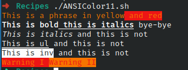

# Codigo 1: ANSIColor

## Funcionalidad
Implementar comandos de ANSI para editar como se visualiza el texto en consola

### **Requerimientos**
No tiene requerimientos

### **Anotaciones**

### **[Codigo #: Title](scriptsrc)**

```bash

```

### **Salidas del codigo**



**[<- Regresar](../README.md)**