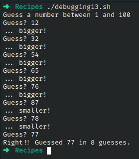

# Codigo 13: Debugging

## Funcionalidad
Estudio de los errores mas comunes en un script

### **Requerimientos**
No tiene requerimientos

### **Anotaciones**
Este codigo esta conformado por dos versiones un erronea y una ya corregida

### **[Codigo 13: HiLow Erroneo]**

```bash
#!/bin/bash
# hilow--A simple number-guessing game

biggest=100
guess=0
guesses=0
number=$(( $$ % $biggest )
echo "Guess a number between 1 and $biggest"

while [ "$guess" -ne $number ] ; do
  /bin/echo -n "Guess? " ; read answer
  if [ "$guess" -lt $number ] ; then
    echo "... bigger!"
  elif [ "$guess" -gt $number ] ; then
    echo "... smaller!
  fi
  guesses=$(( $guesses + 1 ))
done

echo "Right!! Guessed $number in $guesses guesses."

exit 0
```

### **[Codigo 13: HiLow Corregido](debugging13.sh)**

```bash
#!/bin/bash

biggest=100
guess=0
guesses=0

number=$(( $RANDOM % $biggest+1 ))
echo "Guess a number between 1 and $biggest"

while [ "$guess" -ne $number ] ; do
    /bin/echo -n "Guess? " ; read guess
    if [ "$guess" -lt $number ] ; then
        echo "... bigger!"
    elif [ "$guess" -gt $number ] ; then
        echo "... smaller!"
    fi
    guesses=$(( $guesses + 1 ))
done

echo "Right!! Guessed $number in $guesses guesses."

exit 0
```

### **Salidas del codigo**



**[<- Regresar](../README.md)**