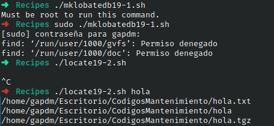

# Codigo 19: Locale Database

## Funcionalidad
El primer script genera un documento.db que contiene el nombre y direccion de la mayoria de documentos de tu computador.
Permitiendote despues con un segundo script buscar los que tengan ciertos caracteres en su ruta o nombre

### **Requerimientos**
Tiene que ser ejecutado como root

### **Anotaciones**
Esta conformado por dos codigos

### **[Codigo 19-1: MK Locale DB](mklobatedb19-1.sh)**

```bash
#!/bin/bash
  
locatedb="/tmp/locate.db"

if [ "$(whoami)" != "root" ] ; then
  echo "Must be root to run this command." >&2
  exit 1
fi

find / -print > $locatedb

exit 0
```

### **[Codigo 19-2: Locale](locate19-2.sh)**

```bash
#!/bin/sh

locatedb="/tmp/locate.db"

exec grep -i "$@" $locatedb
```

### **Salidas del codigo**



**[<- Regresar](../README.md)**
