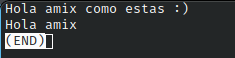
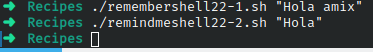

# Codigo 22: Remind Me

## Funcionalidad
El primer script genera una lista de recordatorios
El segundo script te muestra toda la lista o si indicas un modificador muestra solo los que contengan esos

### **Requerimientos**
No tiene requerimientos

### **Anotaciones**
Este codigo esta conformado por dos scripts

### **[Codigo 22-1: Remember](remembershell22-1.sh)**

```bash
#!/bin/bash

rememberfile="$HOME/.remember"

if [ $# -eq 0 ] ; then
  echo "Enter note, end with ^D: "
  cat - >> $rememberfile
else
  echo "$@" >> $rememberfile
fi

exit 0
```

### **[Codigo 22-2: Remind Me](remindmeshell22-2.sh)**

```bash
#!/bin/bash

rememberfile="$HOME/.remember"

if [ ! -f $rememberfile ] ; then
  echo "$0: You don't seem to have a .remember file." >&2
  echo "To remedy this, please use 'remember' to add reminders" >&2
  exit 1
fi

if [ $# -eq 0 ] ; then
  more $rememberfile
else
  grep -i -- "$@" $rememberfile | ${PAGER:-more}
fi

exit 0
```

### **Salidas del codigo**




**[<- Regresar](../README.md)**