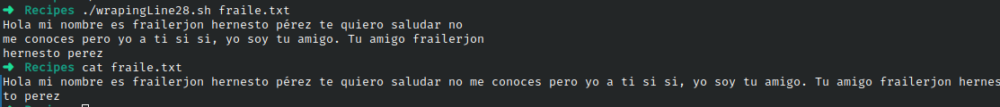

# Codigo 28: Wraping Line

## Funcionalidad
Convierte lineas de texto dentro de mas de 72 caracteres de un documento en multilinea

### **Requerimientos**
No tiene requerimientos

### **Anotaciones**
El codigo funciono directamente

### **[Codigo 28: Wraping Line](wrapingLine28.sh)**

```bash
#!/bin/bash

width=72

if [ ! -r "$1" ] ; then
  echo "Cannot read file $1" >&2
  echo "Usage: $0 filename" >&2; exit 1
fi

while read input
do
   if [ ${#input} -gt $width ] ; then
     echo "$input" | fmt 
   else
     echo "$input"
   fi
done < $1

exit 0
```

### **Salidas del codigo**



**[<- Regresar](../README.md)**