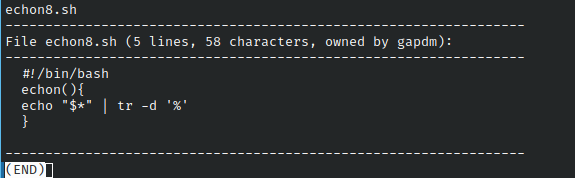

# Codigo 29: File Detalles

## Funcionalidad
Muestra el contenido y detalles de un documento ingresado

### **Requerimientos**
No tiene requerimientos

### **Anotaciones**
El codigo funciono directamente

### **[Codigo 29: File Detalles](fileDetalles.29.sh)**

```bash
#!/bin/bash

width=72
for input
do
  echo $input
  lines="$(wc -l < $input | sed 's/ //g')"
  chars="$(wc -c < $input | sed 's/ //g')"
  owner="$(ls -ld $input | awk '{print $3}')"
  echo "-----------------------------------------------------------------"
  echo "File $input ($lines lines, $chars characters, owned by $owner):"
  echo "-----------------------------------------------------------------"
  while read line 
  do
    if [ ${#line} -gt $width ] ; then
      echo "$line" | fmt | sed -e '1s/^/  /' -e '2,$s/^/+ /'
    else
      echo "  $line"
    fi
  done < $input

  echo "-----------------------------------------------------------------"

done | ${PAGER:more}

exit 0
```

### **Salidas del codigo**




**[<- Regresar](../README.md)**
