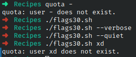

# Codigo 30: New Quota

## Funcionalidad
Ejecuta el comando quota pero con nuevas flags

### **Requerimientos**
Requiere que instales el paquete quota-tools

### **Anotaciones**
Comando quota funciona y ejecuta sin embargo no muestra nada en consola amenos que sea un error

### **[Codigo 30: New Quota](flags30.sh)**

```bash
#!/bin/bash

flags=""
realquota="$(which quota)"

while [ $# -gt 0 ]
do
  case $1
  in
    --help)  echo "Usage: $0 [--group --verbose --quiet -gvq]" >&2
                       exit 1 ;;
    --group )  flags="$flags -g";       shift ;;
    --verbose)  flags="$flags -v";   shift ;;
    --quiet)  flags="$flags -q";       shift ;;
    --)  shift;           break ;;
    *)  break;
  esac
done

exec $realquota $flags "$@"
```

### **Salidas del codigo**



**[<- Regresar](../README.md)**