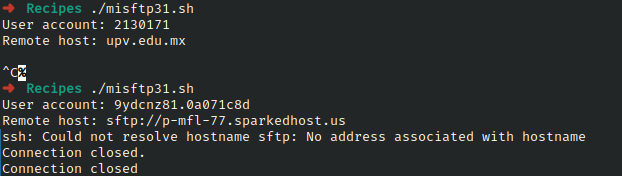

# Codigo 31: Mi FTP

## Funcionalidad
Tiene la funcion de hacer que el comando sftp mas comodo

### **Requerimientos**
No tiene requerimientos

### **Anotaciones**
Personalmente no tengo un hostname de ftp el script funciona pero la salida del comando final sftp indicara que la conexion se vio cortada. Eso sin embargo no tiene nada que ver con esta parte del script

### **[Codigo 31: Mi FTP](misftp31.sh)**

```bash
#!/bin/bash

/bin/echo -n "User account: "
read account

if [ -z $account ] ; then
  exit 0;
fi

if [ -z "$1" ] ; then
  /bin/echo -n "Remote host: "
  read host
  if [ -z $host ] ; then
    exit 0
  fi
else
  host=$1
fi

exec sftp -C $account@$host
```

### **Salidas del codigo**



**[<- Regresar](../README.md)**