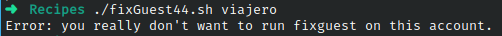

# Codigo 44: Fix Guest

## Funcionalidad
Limpia detras de un usuario de paso

### **Requerimientos**
Ser ejecutado por un usuario de paso

### **Anotaciones**
No se como convertirme en un usuario de paso asi que solo logre entrar al caso de "No quieres ejecutar fixguest en esta cuenta"

### **[Codigo 44: Fix Guest](fixGuest44.sh)**

```bash
#!/bin/bash

iam=$(id -un)
myhome="$(grep "^${iam}:" /etc/passwd | cut -d: -f6)"

if [ "$iam" != "guest" ] ; then
  echo "Error: you really don't want to run fixguest on this account." >&2
  exit 1
fi

if [ ! -d $myhome/..template ] ; then
  echo "$0: no template directory found for rebuilding." >&2
  exit 1
fi

cd $myhome

rm -rf * $(find . -name ".[a-zA-Z0-9]*" -print)

cp -Rp ..template/* .
exit 0
```

### **Salidas del codigo**



**[<- Regresar](../README.md)**