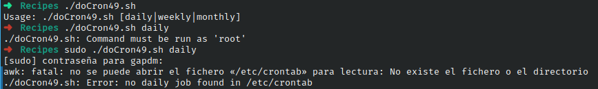

# Codigo 49: Do Cron

## Funcionalidad
Revisa la carpeta crontab en busca de una actividad diaria, semanal o mensual

### **Requerimientos**
Se tiene que ejecutar como root

### **Anotaciones**
No se crear actividades de crontab sin embargo el codigo funciona pues entra al campo de error en lugar de simplemente crashear

### **[Codigo #: Title](doCron49.sh)**

```bash
#!/bin/bash

rootcron="/etc/crontab"

if [ $# -ne 1 ] ; then
  echo "Usage: $0 [daily|weekly|monthly]" >&2
  exit 1
fi

if [ "$(id -u)" -ne 0 ] ; then
  echo "$0: Command must be run as 'root'" >&2
  exit 1
fi

job="$(awk "NF > 6 && /$1/ { for (i=7;i<=NF;i++) print \$i }" $rootcron)"

if [ -z "$job" ] ; then
  echo "$0: Error: no $1 job found in $rootcron" >&2
  exit 1
fi

SHELL='which sh'

eval $job
```

### **Salidas del codigo**



**[<- Regresar](../README.md)**