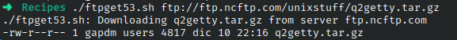

# Codigo 53: FTP Get

## Funcionalidad
Descarga un documento por medio de FTP

### **Requerimientos**
Requiere el paquete inetutils para el comando ftp

### **Anotaciones**
El enlace usado de descarga fue el que se encuentra en el libro

### **[Codigo 53: FTP Get](ftpget53.sh)**

```bash
#!/bin/bash

anonpass="$LOGNAME@$(hostname)"

if [ $# -ne 1 ] ; then
  echo "Usage: $0 ftp://..." >&2
  exit 1
fi

if [ "$(echo $1 | cut -c1-6)" != "ftp://" ] ; then
  echo "$0: Malformed url. I need it to start with ftp://" >&2; 
  exit 1
fi

server="$(echo $1 | cut -d/ -f3)"
filename="$(echo $1 | cut -d/ -f4-)"
basefile="$(basename $filename)"

echo ${0}: Downloading $basefile from server $server

ftp -np << EOF
open $server
user ftp $anonpass
get "$filename" "$basefile"
quit
EOF

if [ $? -eq 0 ] ; then
  ls -l $basefile
fi

exit 0
```

### **Salidas del codigo**



**[<- Regresar](../README.md)**