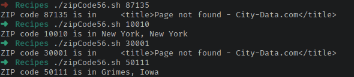

# Codigo 56: ZIP Code

## Funcionalidad
Dado un codigo "ZIP" o postal de Estados Unidos nos mostrara a donde pertenece

### **Requerimientos**
Conexion a internet

### **Anotaciones**
Funciono directamente

### **[Codigo 56: ZIP Code](zipCode56.sh)**

```bash
#!/bin/bash

baseURL="http://www.city-data.com/zips"

/bin/echo -n "ZIP code $1 is in "

curl -s -dump "$baseURL/$1.html" | \
   grep -i '<title>' | \
   cut -d\( -f2 | cut -d\) -f1

exit 0
```

### **Salidas del codigo**



**[<- Regresar](../README.md)**