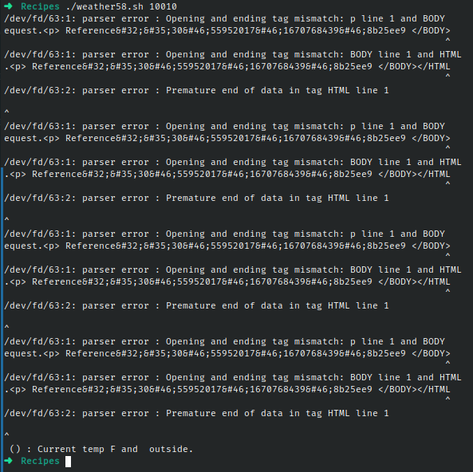

# Codigo 58: Track the Weather

## Funcionalidad
Muestra el clima de un codigo postal dado

### **Requerimientos**
Una API de wunderground.com

### **Anotaciones**
Pese a haber solicitado mi propia API de la pagina por cambios de sus politicas ahora la API generada conecta solo a un dispositivo fisico entonces menti diciendo que tenia una antena de Raspberry PI en Ohio y asi pude solicitar mi api. Aun asi no conecta a la pagina.

Pese a esto se puede ver como el error proviene de la pagina y el script hace lo que deberia.

### **[Codigo 58: Track the Weather](weather58.sh)**

```bash
#!/bin/bash

if [ $# -ne 1 ]; then
  echo "Usage: $0 <zipcode>"
  exit 1
fi

apikey="603ce552cd7a4495bce552cd7a84952c"

weather=`curl -s \
    "https://api.wunderground.com/api/$apikey/conditions/q/$1.xml"`
state=`xmllint --xpath \
     //response/current_observation/display_location/full/text\(\) \
     <(echo $weather)`
zip=`xmllint --xpath \
     //response/current_observation/display_location/zip/text\(\) \
     <(echo $weather)`
current=`xmllint --xpath \
     //response/current_observation/temp_f/text\(\) \
     <(echo $weather)`
condition=`xmllint --xpath \
     //response/current_observation/weather/text\(\) \
     <(echo $weather)`

echo $state" ("$zip") : Current temp "$current"F and "$condition" outside." 
```

### **Salidas del codigo**



**[<- Regresar](../README.md)**