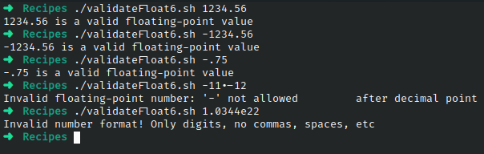

# Codigo 6 Valid Float

## Funcionalidad
El codigo 6 tiene la funcion de validar el formato de un numero flotante indicando si este es valido o no y el porque.

### **Requerimientos**
Este codigo requiere de el codgio 5 "ValidInt" para funcionar correctamente

### **[Codigo 5: Valid Int](validInt5.sh)**

```bash
#!/bin/bash

validint()
{
  number="$1";      min="$2";      max="$3"

  if [ -z $number ] ; then
    echo "You didn't enter anything. Please enter a number." >&2 ; return 1
  fi

  if [ "${number%${number#?}}" = "-" ] ; then
    testvalue="${number#?}"
  else
    testvalue="$number"
  fi
  
  nodigits="$(echo $testvalue | sed 's/[[:digit:]]//g')"
  
  if [ ! -z $nodigits ] ; then
    echo "Invalid number format! Only digits, no commas, spaces, etc" >&2
    return 1
  fi
  
  if [ ! -z $min ] ; then
    if [ "$number" -lt "$min" ] ; then
      #echo "$number is too small: smallest acceptable value is $min" >&2
      return 1
    fi
  fi
  if [ ! -z $max ] ; then
    if [ "$number" -gt "$max" ] ; then
      #echo "Your value is too big: largest acceptable value is $max" >&2
      return 1
    fi
  fi
  return 0
}
```

### **Anotaciones**
Este codigo funciono de forma directa y no fue necesario corregirlo

### **[Codigo 6: Valid Float](validateFloat6.sh)**

```bash
#!/bin/bash

. validInt5.sh

validfloat()
{
  fvalue="$1"
  if [ ! -z $(echo $fvalue | sed 's/[^.]//g') ] ; then
    decimalPart="$(echo $fvalue | cut -d. -f1)"
    fractionalPart="${fvalue#*\.}"

    if [ ! -z $decimalPart ] ; then
      if ! validint "$decimalPart" "" "" ; then
        return 1
      fi 
    fi

    if [ "${fractionalPart%${fractionalPart#?}}" = "-" ] ; then
      echo "Invalid floating-point number: '-' not allowed \
        after decimal point" >&2
      return 1
    fi 
    if [ "$fractionalPart" != "" ] ; then 
      if ! validint "$fractionalPart" "0" "" ; then
        return 1
      fi
    fi
  else 
    if [ "$fvalue" = "-" ] ; then
      echo "Invalid floating-point format." >&2 ; return 1
    fi

    if ! validint "$fvalue" "" "" ; then
      return 1
    fi
  fi

  return 0
}

if validfloat $1 ; then
  echo "$1 is a valid floating-point value"
fi

exit 0
```

### **Salidas del codigo**



**[Regresar](../README.md)**