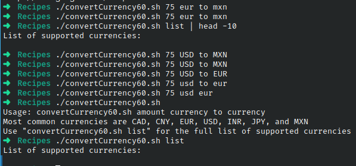

# Codigo 60: Currency Converter

## Funcionalidad
Convierte monedas de una a otra

### **Requerimientos**
Requiere conexion a internet

### **Anotaciones**
La pagina de google finance ya no existe. Probe con otras 10 calculadoras distintas de las cuales al parecer ninguna funciona de una forma tan simple como para llamar una id y mostrar el resultado.

Muchas ejectuan un script que no guarda variable, otras directamente no tenen variable y son un string que se actualiza por una operacion.

### **[Codigo 60: Currency Converter](convertCurrency60.sh)**

```bash
#!/bin/bash

if [ $# -eq 0 ]; then
  echo "Usage: $(basename $0) amount currency to currency"
  echo "Most common currencies are CAD, CNY, EUR, USD, INR, JPY, and MXN"
  echo "Use \"$(basename $0) list\" for the full list of supported currencies"
fi

if [ $(uname) = "Darwin" ]; then
  LANG=C 
fi

url="https://www.google.com/finance/converter"
tempfile="/tmp/converter.$$"
lynx=$(which lynx)

currencies=$($lynx -source "$url" | grep "option  value=" | \
    cut -d\" -f2- | sed 's/">/ /' | cut -d\( -f1 | sort | uniq)

if [ $# -ne 4 ] ; then
  if [ "$1" = "list" ] ; then
    echo "List of supported currencies:"
    echo "$currencies"
  fi
  exit 0
fi

if [ $3 != "to" ] ; then
  echo "Usage: $(basename $0) value currency TO currency"
  echo "(use \"$(basename $0) list\" to get a list of all currency values)"
  exit 0
fi

amount=$1
basecurrency="$(echo $2 | tr '[:lower:]' '[:upper:]')"
targetcurrency="$(echo $4 | tr '[:lower:]' '[:upper:]')"

$lynx -source "$url?a=$amount&from=$basecurrency&to=$targetcurrency" | \
  grep 'id=currency_converter_result' | sed 's/<[^>]*>//g'

exit 0
```

### **Salidas del codigo**



**[<- Regresar](../README.md)**