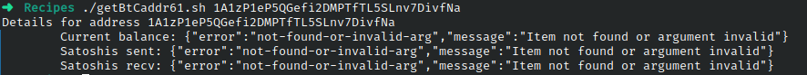

# Codigo 61: Get BTC Adress Details

## Funcionalidad
Muestra detalles de una direccion BTC

### **Requerimientos**
Conexion a internet

### **Anotaciones**
La pagina de blockchain.info ya no tiene la funcionalidad de dar detalles de direcciones BTC ahora solo da informacion de como usar una API que hace lo mismo.

Probe con otras 3 paginas de direcciones BTC y ninguna funciona con subdirectorios que den los datos.

### **[Codigo 61: Get BTC Adress Details](getBtCaddr61.sh)**

```bash
#!/bin/bash

if [ $# -ne 1 ]; then
  echo "Usage: $0 <address>"
  exit 1
fi

base_url="https://blockchain.info/q/"

balance=$(curl -s $base_url"addressbalance/"$1)
recv=$(curl -s $base_url"getreceivedbyaddress/"$1)
sent=$(curl -s $base_url"getsentbyaddress/"$1)
first_made=$(curl -s $base_url"addressfirstseen/"$1)

echo "Details for address $1"
echo -e "\tFirst seen: "$(date -d @$first_made)
echo -e "\tCurrent balance: "$balance
echo -e "\tSatoshis sent: "$sent
echo -e "\tSatoshis recv: "$recv
```

### **Salidas del codigo**



**[<- Regresar](../README.md)**