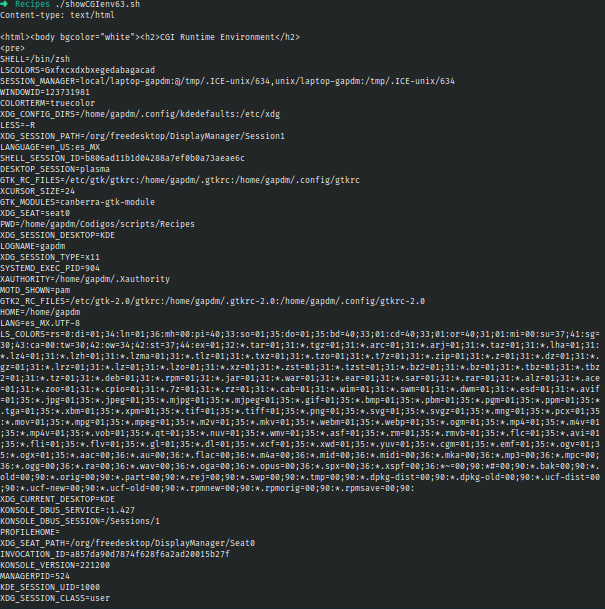

# Codigo 63: Seeing CGI Enviroment

## Funcionalidad
Imprime el entorno de desarrollo en formato HTML

### **Requerimientos**
No tiene requeirmientos

### **Anotaciones**
Funciona

### **[Codigo 63: Seeing CGI Enviroment](showCGIenv63.sh)**

```bash
#!/bin/bash

echo "Content-type: text/html"
echo ""

echo "<html><body bgcolor=\"white\"><h2>CGI Runtime Environment</h2>"
echo "<pre>"
env || printenv
echo "</pre>"
echo "<h3>Input stream is:</h3>"
echo "<pre>"
cat -
echo "(end of input stream)</pre></body></html>"

exit 0
```

### **Salidas del codigo**



**[<- Regresar](../README.md)**
