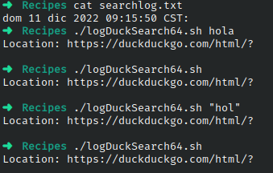

# Codigo 64: Log DuckDuckGo

## Funcionalidad
Genera un log de busquedas

### **Requerimientos**
Conexion a internet

### **Anotaciones**
El codigo funciono directamente

### **[Codigo 64: Log DuckDuckGo](logDuckSearch64.sh)**

```bash
#!/bin/bash

logfile="./searchlog.txt"

if [ ! -f $logfile ] ; then
  touch $logfile
  chmod a+rw $logfile
fi

if [ -w $logfile ] ; then
  echo "$(date): $QUERY_STRING" | sed 's/q=//g;s/+/ /g' >> $logfile
fi

echo "Location: https://duckduckgo.com/html/?$QUERY_STRING"
echo ""

exit 0

```

### **Salidas del codigo**



**[<- Regresar](../README.md)**