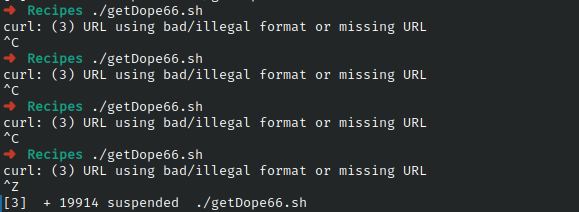

# Codigo 66: Turn Website into EMail

## Funcionalidad
Envia una pagina web por medio de correo electronico

### **Requerimientos**
Acceso a internet

### **Anotaciones**
No funciona. Curl indica que el formato del URL es incorrecto o invalido sin embargo el url es valido

### **[Codigo 66: Turn Website into EMail](getDope66.sh)**

```bash
#!/bin/bash
now="$(date +%y%m%d)"
start="http://www.straightdope.com/ "
to="gerairampdm@gmail.com"   

URL="$(curl -s "$start" | \
grep -A1 'teaser' | sed -n '2p' | \
cut -d\" -f2 | cut -d\" -f1)"

( cat << EOF
Subject: The Straight Dope for $(date "+%A, %d %B, %Y")
From: Cecil Adams <dont@reply.com>
Content-type: text/html
To: $to

EOF

curl "$URL"
) | /usr/sbin/sendmail -t

exit 0
```

### **Salidas del codigo**



**[<- Regresar](../README.md)**