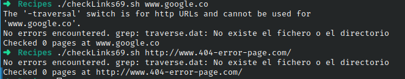

# Codigo 69: Check Link

## Funcionalidad
Revisa una pagina web en busca de sublinks

### **Requerimientos**
Conexion a internet

### **Anotaciones**
Funciono directamente

### **[Codigo 69: Check Link](checkLinks69.sh)**

```bash
#!/bin/bash

trap "`which rm` -f traverse.dat traverse2.dat" 0

if [ -z "$1" ] ; then
  echo "Usage: checklinks URL" >&2 ; exit 1
fi

baseurl="$(echo $1 | cut -d/ -f3 | sed 's/http:\/\///')"

lynx -traversal -accept_all_cookies -realm "$1" > /dev/null

if [ -s "traverse.errors" ] ; then
 echo -n $(wc -l < traverse.errors) errors encountered.
 echo  Checked $(grep '^http' traverse.dat | wc -l) pages at ${1}:
 sed "s|$1||g" < traverse.errors
 mv traverse.errors ${baseurl}.errors
 echo "(A copy of this output has been saved in ${baseurl}.errors)"
else
 echo -n "No errors encountered. ";
 echo Checked $(grep '^http' traverse.dat | wc -l) pages at ${1}  
fi

if [ -s "reject.dat" ]; then
 mv reject.dat ${baseurl}.rejects
fi

exit 0
```

### **Salidas del codigo**



**[<- Regresar](../README.md)**