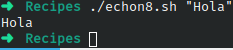

# Codigo 8: Echon

## Funcionalidad
Este codigo tiene la funcionalidad funcion de remplazar un "echo -n"

### **Requerimientos**
No tiene requerimientos

### **Anotaciones**
Este codigo tiene 3 formas de las cuales la usada es la ultima pero remplazando un '\n' por un '%' para eliminar el ultimo caracter que se imprime.

### **[Codigo 8: Echon](echon8.sh)**

```bash
#!/bin/bash
echon(){
    echo "$*" | tr -d '%'
}

echon $*
```

### **Salidas del codigo**



**[<- Regresar](../README.md)**