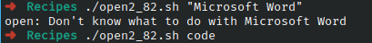

# Codigo 82: Open 2

## Funcionalidad
Una version mejor del comando open

### **Requerimientos**
No tiene requerimientos

### **Anotaciones**
Funciono directamente

### **[Codigo 82: Open 2](open2_82.sh)**

```bash
#!/bin/bash}

if ! xdg-open "$@" >/dev/null 2>&1 ; then
  if ! xdg-open -a "$@" >/dev/null 2>&1 ; then

    if [ $# -gt 1 ] ; then
      echo "open: Can't figure out how to open or launch $@More than one program not supported" >&2
      exit 1
    else
        case $(echo $1 | tr '[:upper:]' '[:lower:]') in
        activ*|cpu   ) app="Activity Monitor"           ;;
        addr*        ) app="Address Book"               ;;
        chat         ) app="Messages"                   ;;
        dvd          ) app="DVD Player"                 ;;
        excel        ) app="Microsoft Excel"            ;;
        info*        ) app="System Information"         ;;
        prefs        ) app="System Preferences"         ;;
        qt|quicktime ) app="QuickTime Player"           ;;
        word         ) app="Microsoft Word"             ;;        
        * ) echo "open: Don't know what to do with $1" >&2
            exit 1
      esac
      echo "You asked for $1 but I think you mean $app." >&2
      xdg-open -a "$app"
    fi
  fi
fi

exit 0
```

### **Salidas del codigo**



**[<- Regresar](../README.md)**