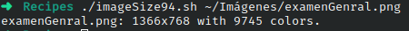

# Codigo 94: Image SIze

## Funcionalidad
Muestra caracteristicas de una imagen dada

### **Requerimientos**
No tiene requerimientos

### **Anotaciones**
Funciono directamente

### **[Codigo 94: Image Size](imageSize94.sh)**

```bash
#!/bin/bash

for name
do
  identify -format "%f: %G with %k colors.\n" "$name"
done
exit 0
```

### **Salidas del codigo**



**[<- Regresar](../README.md)**